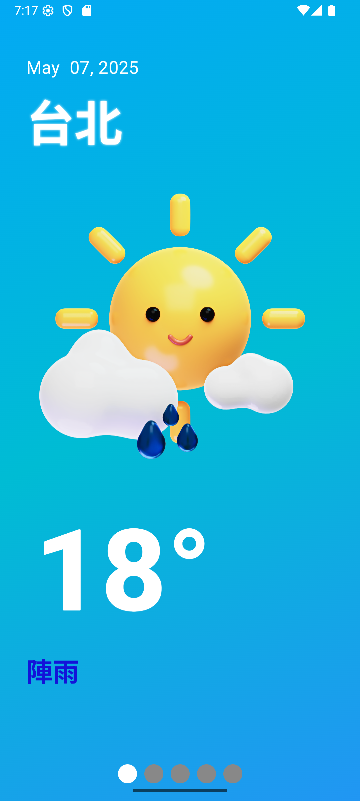
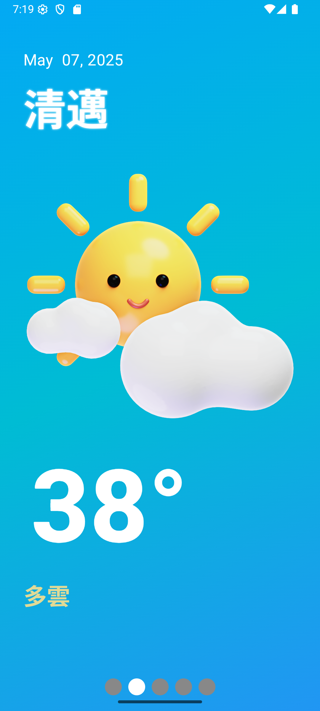
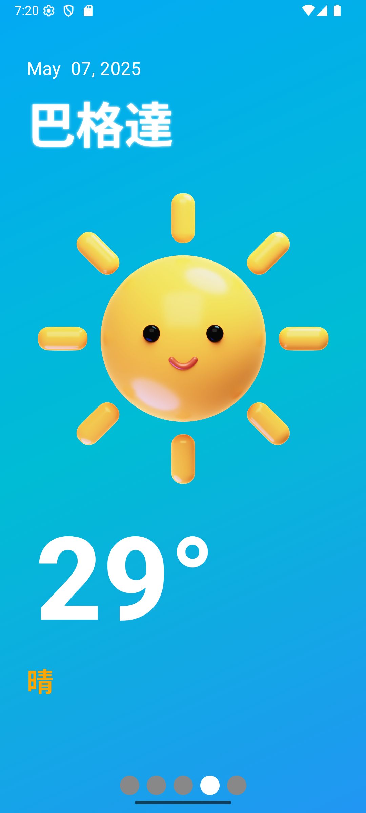

# 🌤️ Weather API Practice App

這是一個使用 Kotlin 和 Jetpack Compose 開發的簡易天氣查詢 App，透過串接 OpenWeatherMap API 取得天氣資訊。此專案為 API 串接與 UI 實作練習。

## 🔧 技術與架構

- Kotlin
- Jetpack Compose
- MVVM 架構
- Retrofit（API 串接）
- OpenWeatherMap API

## 📸 截圖

台北：

清邁：

巴格達：

